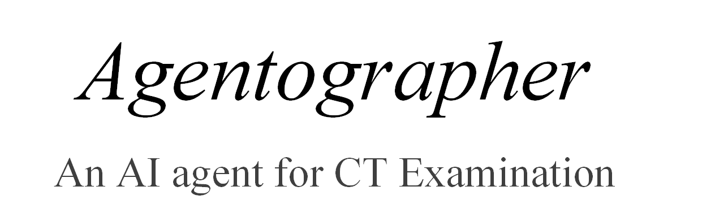
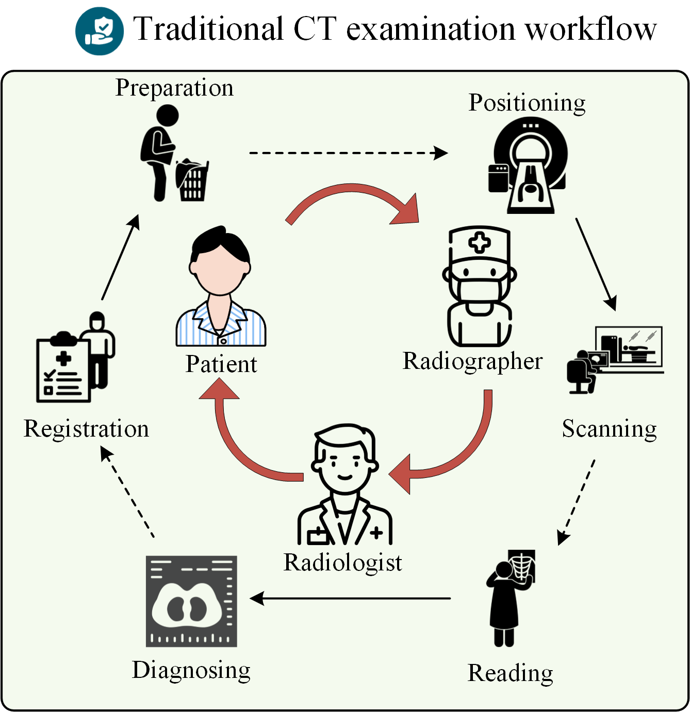
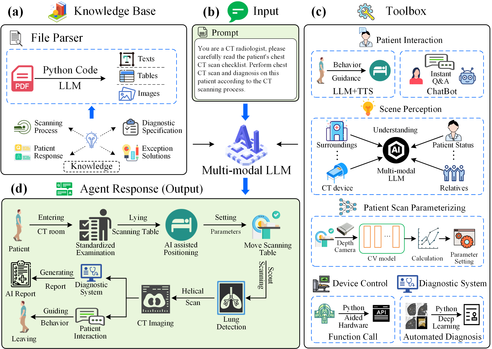

# *Agentographer*


<div align="center">
  
  <div align="center"></div>
</div>


[Research Square] The official codes for "A CT Operation Agent "Agentographer" built on Multimodal Large Language Model versus Radiographer in Chest CT Lung Cancer Screening".

[Paper (Research Square version)](https://www.researchsquare.com/article/rs-6101023)

[GitHub Repository](https://github.com/senli2018/Agentographer)

## Video Demo of the Agentographer
Will be released soon.

## Introduction
In this paper, we aim to achieve full-automated intelligent CT examinatin, and develop an AI-driven CT Operation Agent, Agentographer, driven by multi-large language model. In general, we present the contribution from the following aspects: 
1. **A Multimodal LLM-driven CT Agent Framework.** We propose the first fully automated CT operation agent integrating multimodal large language model, CT examination knowledge base, a toolbox involving related computer vision models and controlling modules, to enable end-to-end intelligent examination workflows, addressing radiographer workload and human-error challenges through unified AI-driven patient interaction, intelligent isocenter positioning, CT scan range determination, LLM-based automated device control, and AI-driven diagnostic and report generation.
2. **A Multimodal Dataset for CT examination scenario.** We curated a multimodal dataset of 100 patients (6168 images), with 50 randomly selected and 50 scenario-varied cases, paired with 8 question types per image (49,344 Q&A pairs) covering patient positioning, posture, accompanier presence, and X-ray shilding door status. 
3. **A Domain-Specialized Multimodal LLM, LLaMA-CT.** To enhance the perception ability for CT examination, we fine-tuned the LLaMA-3.2-11b-Vision-Instruct model by the curated multimodal dataset to develop LLaMA-CT, a specialized multimodal large language model tailored to the scene understanding, accompaniers perception, and patient status identification in CT examination workflows. The LLaMA-CT is in charge of the planning and decision in the Agentographer.
3. **A Series of task-specific Models for Automated CT Operation.** We developed a tool box involving several deep learning models for complete the CT examination workflow. In detail, the isocenter positioning module deploys RTMPose to detect body joints, determining the scanning start and ending points of the scout scan, assisted by the depth image from the RGB-D camera. A SAM2-based segmentation model is employed in the CT scan range determination module to localize the lung field. Besides, a widely-recognized lung nodule detection model, 3D deep Leaky Noisy-or Network is incorporated into the AI-driven diagnostic and report generation module.
4. **A set of Functional Programs for CT Workflow.** We developed two major programs about LLM-based patient interaction module involving behavior guidance and intelligent Q&A, and LLM-based automated device control module, including the patient information registration, shielding door control(open/close), table movement control (up/down, in/out), tube exposure control (initiating scout scan and CT scan), CT scan positioning frame adjustment, and scan parameter selection.

## Table of Contents
- [Video Demo](#Video-Demo-of-the-Agentographer)
- [Introduction](#Introduction)
- [The traditional workflow of CT examination](#The-traditional-workflow-of-CT-examination)
- [The Agent Framework of Agentographer](#The-Agent-Framework-of-Agentographer)
  - [Integrated Hardware Solution for Agentographer](#Integrated-Hardware-Solution-for-Agentographer)
  - [Toolbox (AI models and softwares) in Agentographer](#Toolbox-(AI-models-and-softwares)-in-Agentographer)
- [Project Structure](#Project-Structure)
- [Acknowledgement](#Acknowledgement)
- [Contact](#Contact)
- [Citation](#citation)
- [Reference](#Reference)

## The Traditional Workflow of CT Examination
The traditional worflow of CT examination is as follows. The process begins with patient registration and information input. Upon entering the scanning room, the radiographer provides verbal instructions to guide the patient in adjusting their body position and posture manually. Key parameters (e.g., scan range, isocenter) are measured and set by the radiographer using physical markers and visual alignment. Once positioning is confirmed, the radiographer configures scan parameters on the CT console and initiates the scan. After image acquisition, the radiographer oversees image reconstruction and transfers the data to radiologists for interpretation and report generation. Concurrently, the radiographer assists the patient in redressing and exiting the room, concluding the procedure.
<div align="center">
  
  <div align="center"></div>
</div>

## The Agent Framework of Agentographer
The operation process of our Agentographer. The process commences with the patient's information registration by a camera and an OCR algorithm at the initial stage. Subsequently, the patient steps into the scanning room. There, the agent will provide the patient with extremely meticulous pre-scan preparation guidance, assisting the patient in accurately adjusting their body position and posture. At the same time, the 3D camera operates efficiently, precisely measuring various key parameters. After the measurement is completed, the system quickly completes the parameter setting based on the measured data, and then smoothly carries out and finishes the CT scan.  Once the CT scan is successfully completed, a dual-track operation will commence.  On one hand, the system efficiently undertakes image interpretation and generates a draft report for radiologists' reference. On the other hand, it simultaneously and attentively guides the patient to put on the clothes that were previously removed. This process continues until the patient departs from the scanning room, marking the conclusion of the entire, streamlined operation.


<div align="center">
  
  <div align="center"></div>
</div>


### Integrated Hardware Solution for Agentographer

To enable seamless automation of CT examination workflows, we designed a robust hardware platform comprising multimodal sensing, real-time device control, and AI-driven decision-making modules. This system spans two functionally distinct spaces: the Scanning Room, optimized for patient interaction and radiation safety, and the Control Room, dedicated to centralized device management and computational processing. Key components include depth-sensing RGB-D cameras for 3D patient modeling, relay-based electromechanical interfaces for scanner/door control, and GPU computing server. 

The details about the spatial distribution, hardware specifications, and functional roles of each subsystem can be seen in the submitted supplementary materials.

**Summary Table: Hardware Collection**  

| **Location**                                                                     | **Hardware Name** | **Role** |
|----------------------------------------------------------------------------------|-------------------|----------|
| Detailed hardware platform can be found in the submitted supplementary Table S1. | ...               | ...      |


--- 

### Toolbox (AI models and softwares) in Agentographer

The **Agentographer** system integrates multiple AI models and software modules to enable end-to-end automation of CT examination workflows, supported by the multimodal hardware platform. Key components include:  

1. **Patient Information Recognition**:  
   - An **OCR engine** extracts patient demographics and scan parameters from requisition forms (via HD camera), which are then input to the system via the **KVM Switch**.  

2. **Behavior Guidance & Intelligent Q&A**:  
   - Combines **LLaMA-CT** (based on knowledge base) with **Web Speech API** for real-time speech recognition and synthesis. This module drives patient interaction through microphones, speakers, and dual displays, delivering posture guidance videos and answering queries.  

3. **Intelligent Isocenter Positioning**:  
   - Uses **RTMPose** (a real-time 2D/3D pose estimation model) on RGB-D camera data to detect anatomical landmarks (e.g., suprasternal notch). Depth images refine 3D body modeling to calculate isocenter coordinates for scout scanning.  

4. **CT Scan Range Determination**:  
   - Leverages **Segment Anything Model (SAM2)** to segment lung fields from scout images (captured via OBS video card). Geometric algorithms define scan ranges (e.g., apex to diaphragm), validated against clinical protocols.  

5. **LLM-Based Device Control**:  
   - Employs **LLaMA-CT’s function calling** to translate natural language decisions (e.g., "start helical scan") into API commands for relays/KVM switches, automating CT console operations.  

6. **AI-Driven Diagnosis & Reporting**:  
   - A **3D Leaky Noisy-or Network** detects pulmonary nodules from chest CT volumes. Post-processing algorithms quantify nodule characteristics (size, diagnosis), while **LLaMA-CT** generates draft diagnostic reports.  

---

**Summary Table: AI Models/Script and Roles**  

| **Module/Function**                                                                 | **Model/API** | **Code Path in this project** | **Role**                                                                                         |  
|-------------------------------------------------------------------------------------|---------------|------------------------------|--------------------------------------------------------------------------------------------------|  
| Detailed models and softwares can be found in the submitted supplementary Table S2. | ...           | ...                          |...|

---

**Key Innovations**:  
- **Multimodal Integration**: Combines vision (RTMPose, SAM), speech (Web Speech API), and language models (LLaMA-CT) for holistic automation.  
- **Hardware-Software Co-Design**: Utilizes APIs (relays, KVM) to bridge AI decisions with physical device control.  
- **Clinical Validation**: All models trained/fine-tuned on domain-specific datasets (e.g., chest CTs, radiology reports).  


## Project Structure
Each module contain the corresponding ReadMe. The detailed information can be seen in each module.
```
Our Agentographer project/
├── AI-Driven-Diagnosis/
│   └── ...
│   └── README.md
├── assets/
│   └── ...
├── CT-Scan-Range-Determination/
│   └── ...
│   └── README.md
├── Intelligent-Isocenter-Positioning/
│   └── ...
│   └── README.md
├── LLaMA-CT/
│   └── ...
│   └── README.md
├── Main-Agentographer/
│   └── ...
│   └── README.md
├── Patient-Information-Rigistration/
│   └── ...
│   └── README.md
├── Real-Time-QA/
│   └── ...
│   └── README.md
└── README.md
```


## Acknowledgement

Llama 3.2 -- https://www.llama.com/docs/model-cards-and-prompt-formats/llama3_2/

AutoGen -- https://microsoft.github.io/autogen/stable/

Tencent Cloud OCR API -- https://cloud.tencent.com

Web Speech API -- https://developer.mozilla.org/zh-CN/docs/Web/API/Web_Speech_API

RTMPose[1] -- https://github.com/open-mmlab/mmpose/tree/main/projects/rtmpose

SAM2[2] -- https://github.com/facebookresearch/sam2

3D Leaky Noisy-or Network[3] -- https://github.com/lfz/DSB2017

## Contact
If you have any question, please feel free to contact senli2018@163.com.

## Citation
```
@misc{qiu2024building,
      title={ A CT Operation Agent "Agentographer" built on Multimodal Large Language Model versus Radiographer in Chest CT Lung Cancer Screening}, 
      author={Xueyi zheng, Sen Li, Wanqing Yi et al.},
      year={2025},
      archivePrefix={PREPRINT (Version 1) available at Research Square},
      doi={https://doi.org/10.21203/rs.3.rs-6101023/v1}
}
```
## Reference
[1] Jiang T, Lu P, Zhang L, et al. Rtmpose: Real-time multi-person pose estimation based on mmpose[J]. arXiv preprint arXiv:2303.07399, 2023.

[2] Ravi N, Gabeur V, Hu Y T, et al. Sam 2: Segment anything in images and videos[J]. arXiv preprint arXiv:2408.00714, 2024.

[3] Liao F, Liang M, Li Z, et al. Evaluate the malignancy of pulmonary nodules using the 3-d deep leaky noisy-or network[J]. IEEE transactions on neural networks and learning systems, 2019, 30(11): 3484-3495.
