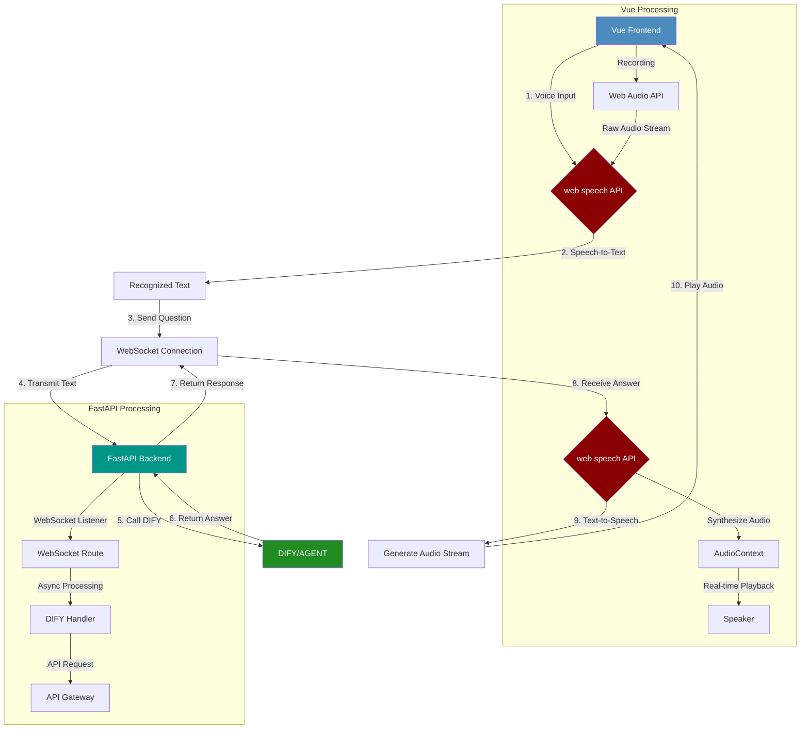

# Real-time Q&A module in Agentographer  (Backened)

This is an Agentographer based on the FastAPI framework, providing DIFY-based AI Q&A services and WebSocket real-time chat functionality.

## Data Flow Diagram



## Project Structure

```
my_fastapi_project/
├── app/
│   ├── __init__.py
│   ├── main.py
│   ├── core/
│   │   ├── __init__.py
│   │   ├── config.py
│   │   └── response.py
│   ├── routers/
│   │   ├── __init__.py
│   │   ├── websocket_router.py
│   └── services/
│       ├── __init__.py
│       ├── chat_service.py
│       ├── websocket_service.py
├── templates/
│   └── chat.html
├── .env
├── .gitignore
├── requirements.txt
├── run.py
└── README.md
```

## Environment Configuration

The project uses an `.env` file to store configuration information. Create an `.env` file and set the following variables:

```
# Application configuration
APP_NAME="FastAPI Application"
DEBUG=True

# Server configuration
HOST=0.0.0.0
PORT=8000
RELOAD=True

# DIFY configuration
DIFY_API_KEY=app-gr6ZJuVij4oWoIJNElfeBe5z
DIFY_API_URL=http://localhost/v1

# WebSocket configuration
WEBSOCKET_HEARTBEAT_INTERVAL=30
WEBSOCKET_HEARTBEAT_TIMEOUT=120
MOCK_MODE=False

# Other configuration
LOG_LEVEL=INFO
```

### About Dify

+ [Dify.AI · The Innovation Engine for Generative AI Applications](https://dify.ai/)
+ [Deploy with Docker Compose | Dify](https://docs.dify.ai/getting-started/install-self-hosted/docker-compose)
+ [Developing with APIs | Dify](https://docs.dify.ai/guides/application-publishing/developing-with-apis)

### Configuration Description

- **DIFY_API_KEY**: DIFY API key, must be set to a valid key to use the API
- **DIFY_API_URL**: DIFY API URL
- **WEBSOCKET_HEARTBEAT_INTERVAL**: WebSocket heartbeat interval (seconds), default is 30 seconds
- **WEBSOCKET_HEARTBEAT_TIMEOUT**: WebSocket heartbeat timeout (seconds), default is 120 seconds
- **MOCK_MODE**: Mock mode switch, when set to `True`, it will not call the actual DIFY API but return mock responses

## Installing Dependencies

```bash
pip install -r requirements.txt
```

## Running the Project

```bash
python run.py
```

Or start directly with uvicorn:

```bash
uvicorn app.main:app --reload
```

Visit http://localhost:8000/docs to view the API documentation.
Visit http://localhost:8000/chat to use the WebSocket chat functionality.

## Standard Response Structure

All API interfaces use a unified response structure:

```json
{
  "code": 200,      // Business status code
  "message": "Operation successful", // Response message
  "data": {         // Response data
    // Specific data content
  }
}
```

### Status Code Description

| Status Code | Description |
|-------|------|
| 200 | Success |
| 400 | Request Error |
| 401 | Unauthorized |
| 403 | Forbidden |
| 404 | Resource Not Found |
| 405 | Method Not Allowed |
| 500 | Server Error |
| 503 | Service Unavailable |
| 504 | Gateway Timeout |
| 10000 | Parameter Error |
| 20000 | Business Error |
| 30000 | Third-party Service Error |
| 40000 | Database Error |
| 90000 | Unknown Error |

## API Documentation


### 1. WebSocket Interface

#### 1.1 WebSocket Chat Interface

- **URL**: `/ws/chat/{client_id}`
- **Description**: Real-time chat with the backend via WebSocket. Each message sent is independent, chat history is not saved

**Parameter Description**:

| Parameter Name | Type | Required | Description |
|-------|------|------|------|
| client_id | String | No | Client ID, automatically generated if not provided |

**Note**:
- If `client_id` is not provided, you can use the `/ws/chat` endpoint, and the system will automatically generate an ID

**Message Format**:

1. Send Message:
```json
{
  "type": "chat",
  "content": "Hello, please introduce yourself"
}
```

2. Heartbeat Message:
```json
{
  "type": "ping",
  "timestamp": 1621234567890
}
```

3. Receive Message:
```json
{
  "type": "chat",
  "role": "assistant",
  "content": "Hello! I am an AI assistant..."
}
```

4. Heartbeat Response:
```json
{
  "type": "pong",
  "timestamp": 1621234567890
}
```
or
```json
{
  "type": "heartbeat",
  "timestamp": 1621234567890
}
```

5. System Message:
```json
{
  "type": "system",
  "content": "Connected to chat server"
}
```

6. Error Message:
```json
{
  "type": "error",
  "content": "Error processing message"
}
```

## WebSocket Client Example

The project includes a simple WebSocket chat client, visit http://localhost:8000/chat to use it.

You can also create your own WebSocket client using the following JavaScript code:

```javascript
// Create WebSocket connection
const socket = new WebSocket('ws://localhost:8000/ws/chat');

// When connection opens
socket.onopen = () => {
    console.log('Connected to chat server');
};

// When receiving messages
socket.onmessage = (event) => {
    const data = JSON.parse(event.data);
    console.log('Received message:', data);
};

// Send message
function sendMessage(content) {
    const message = {
        type: 'chat',
        content: content
    };
    socket.send(JSON.stringify(message));
}

// Example: Send message
sendMessage('Hello, please introduce yourself');
```

## WebSocket Chat Functionality

### Heartbeat Mechanism

The WebSocket chat functionality implements a heartbeat mechanism to keep connections active and detect disconnected connections. The heartbeat mechanism works as follows:

1. **Server Heartbeat**:
   - The server checks client activity status every `WEBSOCKET_HEARTBEAT_INTERVAL` seconds (default 30 seconds)
   - If a client has been inactive for more than `WEBSOCKET_HEARTBEAT_INTERVAL` seconds, the server sends a heartbeat message
   - If a client has been inactive for more than `WEBSOCKET_HEARTBEAT_TIMEOUT` seconds (default 120 seconds), the server disconnects the connection

2. **Client Heartbeat**:
   - The client sends a ping message every 25 seconds
   - The client processes heartbeat and pong messages sent by the server
   - The client automatically attempts to reconnect when the connection is lost, using an exponential backoff strategy

3. **Heartbeat Message Format**:
   - Client sends: `{"type": "ping", "timestamp": 1621234567890}`
   - Server responds: `{"type": "pong", "timestamp": 1621234567890}`
   - Server proactively sends: `{"type": "heartbeat", "timestamp": 1621234567890}`

The heartbeat mechanism ensures that connections idle for long periods are not disconnected by intermediate devices (such as proxies, firewalls) and can also promptly detect disconnected connections.

### Mock Mode

When `MOCK_MODE` is set to `True`, the system runs in mock mode and does not call the actual DIFY API but returns mock responses. This is very useful in the following situations:

- API key is invalid or not set
- Development and testing environments
- DIFY API service is unavailable

Mock responses will include the user's original question and indicate that this is a mock response.

### Error Handling

The WebSocket chat functionality implements comprehensive error handling mechanisms to ensure stability in various exceptional situations:

1. **Connection State Check**:
   - Check WebSocket connection status before sending messages
   - Detect closed connections and clean up related resources
   - Prevent sending messages to closed connections

2. **Exception Catching and Recovery**:
   - Catch and handle JSON parsing errors
   - Handle network exceptions and connection interruptions
   - Perform error checking at various stages of message processing

3. **Graceful Degradation**:
   - Automatically switch to mock responses when API calls fail
   - Provide friendly error messages for connection errors
   - Disconnection reconnection mechanism, supporting exponential backoff strategy

These error handling mechanisms ensure the stability and reliability of the WebSocket service when facing various exceptional situations, providing a better user experience.

## Logging System

The project implements a comprehensive logging system, supporting console output and file recording:

### Log Files

Log files are saved in the `logs` folder in the project root directory:

- **info.log**: Records all logs of INFO level and above
- **error.log**: Records only ERROR level error logs

Log files use a rotating write method, with each file a maximum of 10MB and keeping up to 5 backup files.

### Log Content

Logs record various aspects of system operation:

1. **Application Lifecycle**: Startup, shutdown, configuration loading
2. **WebSocket Connections**: Client connections, disconnections, message processing
3. **API Calls**: Request parameters, response time, token usage
4. **Error Handling**: Exception information, error stacks, recovery measures

### Log Levels

You can set the log level in the `.env` file via `LOG_LEVEL`:

```
LOG_LEVEL=DEBUG  # Optional values: DEBUG, INFO, WARNING, ERROR, CRITICAL
```

The default level is INFO, and it is recommended to use INFO or WARNING level in production environments.
